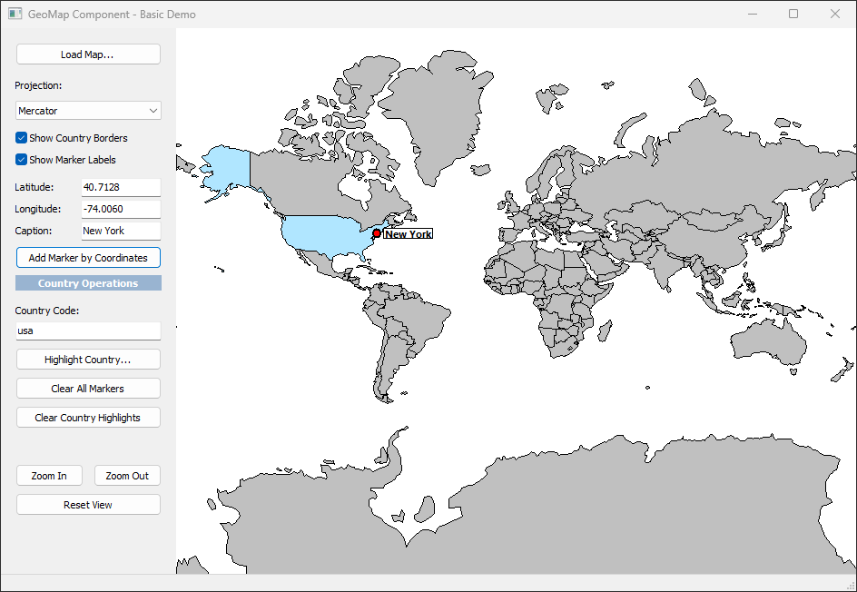

# Delphi GeoMap Component

A pure Delphi VCL component for displaying geographic maps with markers, country highlighting, and interactive features.

<p align="center">
  
</p>

## Features

✅ **Zero Dependencies** - Pure Delphi, no external libraries  
✅ **GeoJSON Support** - Loads standard GeoJSON map data  
✅ **Map Projections** - Mercator and Equirectangular  
✅ **Markers** - Add markers by coordinates or country code  
✅ **Interactive** - Click, hover, zoom, pan  
✅ **Customizable** - Colors, borders, events  
✅ **Lightweight** - Fast native rendering  

## Quick Start

### Installation

### Step 1: Compile the Runtime Package

1. Open Delphi IDE
2. Navigate to: `Packages/GeoMapComponents.dpk`
3. Right-click the project and select **Compile**
4. Wait for "Compile successful" message
5. **Close this package** (you're done with it)

### Step 2: Install the Design-Time Package

1. Navigate to: `Packages/GeoMapComponentsDesign.dpk`
2. Right-click the project and select **Install**
3. You should see a message: "Package GeoMapComponentsDesign has been installed"
4. The component will appear in the **Tool Palette** under "GeoMap" category

### Step 3: Add Source to Library Path
1. Tools → Options → Language → Delphi → Library
2. Click "..." next to Library Path
3. Add: `<YourPath>\Delphi GeoMap Component\Source`
4. Click OK

### Basic Usage

```pascal
procedure TForm1.FormCreate(Sender: TObject);
begin
  // Load world map
  GeoMap1.LoadMapFromFile('world.geojson');
  
  // Add markers
  GeoMap1.AddMarker(40.7128, -74.0060, 'New York');
  GeoMap1.AddMarker(51.5074, -0.1278, 'London');
  
  // Highlight countries
  GeoMap1.SetCountryColor('usa', clRed);
  GeoMap1.SetCountryColor('gbr', clBlue);
end;
```

## Component Properties

| Property | Type | Description |
|----------|------|-------------|
| `ProjectionType` | TMapProjectionType | Map projection (Mercator/Equirectangular) |
| `ShowCountryBorders` | Boolean | Show country borders |
| `BorderColor` | TColor | Border line color |
| `BorderWidth` | Integer | Border line width |
| `DefaultCountryColor` | TColor | Default fill color for countries |
| `HoverColor` | TColor | Color when hovering over country |
| `ZoomLevel` | Single | Current zoom level (0.5-10.0) |

## Component Methods

### Map Loading
- `LoadMapFromFile(FileName: string)` - Load GeoJSON from file
- `LoadMapFromJSON(JSON: string)` - Load GeoJSON from string

### Markers
- `AddMarker(Lat, Lon: Double; Caption: string): TGeoMarker` - Add marker by coordinates
- `ClearMarkers` - Remove all markers

### Navigation
- `ZoomIn` - Increase zoom level
- `ZoomOut` - Decrease zoom level
- `ResetView` - Reset to default view
- `CenterOn(Lat, Lon: Double)` - Center map on coordinates
- `CenterOnCountry(CountryCode: string)` - Center on country

### Country Operations
- `SetCountryColor(CountryCode: string; Color: TColor)` - Set country fill color
- `SetCountryValue(CountryCode: string; Value: Double)` - Set country data value
- `FindCountryAt(X, Y: Integer): TGeoCountry` - Get country at screen position

### Coordinate Conversion
- `LatLonToScreen(Point: TGeoPoint): TPointF` - Convert geo to screen coordinates
- `ScreenToLatLon(Point: TPointF): TGeoPoint` - Convert screen to geo coordinates

## Events

- `OnMarkerClick(Sender: TObject; Marker: TGeoMarker)` - Fired when marker is clicked
- `OnCountryClick(Sender: TObject; Country: TGeoCountry)` - Fired when country is clicked

## File Structure

```
Delphi GeoMap Component/
├── Packages/
│   ├── GeoMapComponents.dpk        # Runtime package
│   └── GeoMapComponentsDesign.dpk  # Design-time package
├── Ressources/
│   └── world.geojson               # World map data
├── Samples/
│   └── BasicMapDemo/               # Basic usage example
├── Source/
│   ├── GeoMap.Types.pas            # Core data types
│   ├── GeoMap.Projection.pas       # Map projections
│   ├── GeoMap.Data.pas             # GeoJSON parser
│   ├── GeoMap.Markers.pas          # Marker system
│   ├── GeoMap.VCL.pas              # Main VCL component
│   └── GeoMap.VCL.Register.pas     # IDE registration
├── demo.png                        # Screenshot
├── README.md                       # This file
└── USAGE_GUIDE.md                  # Detailed usage guide
```

## GeoJSON Format

The component uses standard GeoJSON FeatureCollection format:

```json
{
  "type": "FeatureCollection",
  "features": [
    {
      "type": "Feature",
      "properties": {
        "shortName": "usa",
        "name": "United States"
      },
      "geometry": {
        "type": "MultiPolygon",
        "coordinates": [[[[lon, lat], ...]]]
      }
    }
  ]
}
```

## Contributing

Contributions are welcome! If you have suggestions or bug fixes, please fork the repository and submit a pull request.


<p align="center">Made with ❤️ using Delphi RAD Studio</p>


